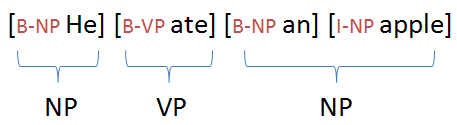

Chunking of text invloves dividing a text into syntactically correlated words. For example, the sentence 'He ate an apple.' can be divided as follows:
 

 
Each chunk has an open boundary and close boundary that delimit the word groups as a minimal non-recursive unit. This can be formally expressed by using IOB prefixes.
  

### Objective

The objective of this experiment is to understand the concept of chunking and get familiar with the basic chunk tagset.